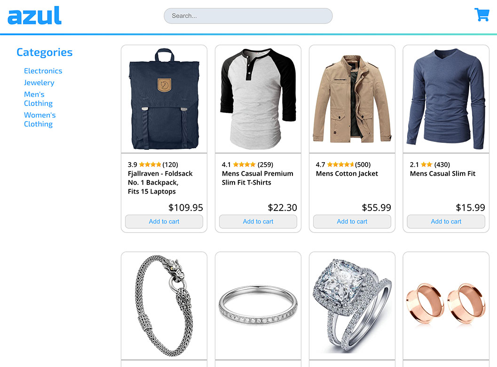

Site is currently deployed [here](https://azul-shopping.netlify.app/).

This shopping cart React project features:

- Storefront with products fetched via Tanstack Query and axios
- Routing and navigation with react-router-dom
- Fuzzy search with fuze.js
- Loading bar and LDRS loading spinners dependent on fetch progress
- UI mockup and evolution created in Photoshop in the design documentation folder
- Vite
- Netlify deployment

